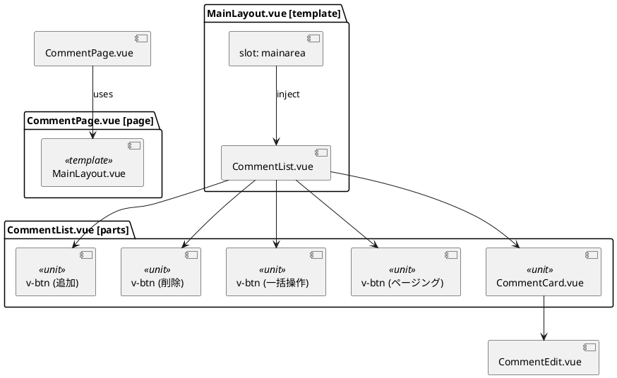

ご指摘ありがとうございます。
おっしゃるとおり、**`page` に該当するのは `MainLayout.vue` ではなく `画面.vue（Page.vue）` の方です。**
以下で正しく整理し直します。

---

## ✅ 正しい構造と責務の整理

| コンポーネント                                          | 種別         | 説明                                                   |
| ------------------------------------------------ | ---------- | ---------------------------------------------------- |
| `Page.vue`（例：CommentPage.vue）                    | `page`     | ルーティング対象。各ページの本体。ここで `MainLayout` に `v-slot` でデータを渡す |
| `MainLayout.vue`                                 | `template` | レイアウトを構成する外枠。slot を受け取って表示枠を作る                       |
| `CommentList.vue`                                | `parts`    | ページ固有の構成要素（一覧）                                       |
| `CommentCard.vue`, `CommentEdit.vue`, `v-btn` など | `unit`     | 表示や操作単位の最小構成要素                                       |

---

## ✅ 修正版：PlantUML コンポーネント図（`Page.vue` が page）

---

## ✅ ポイントまとめ

| 誤り                                                | 修正内容                                     |
| ------------------------------------------------- | ---------------------------------------- |
| ❌ `MainLayout.vue` を `page` としていた                 | ✅ 正しくは `CommentPage.vue`（画面ファイル）が `page` |
| ❌ `CommentList.vue` を `MainLayout` に直配置したかのように見える | ✅ 実際は `CommentPage.vue` から slot を通じて配置   |

---

ご希望があれば、**これを PDF化／画像化**したり、**他のページ構成でも展開**可能です。必要であればお知らせください。
