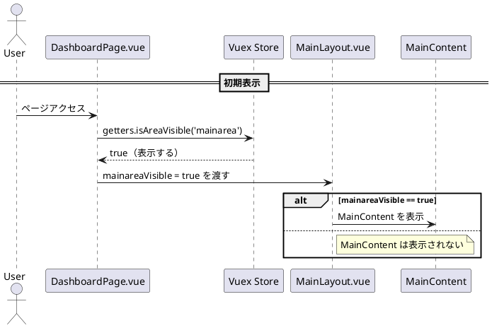
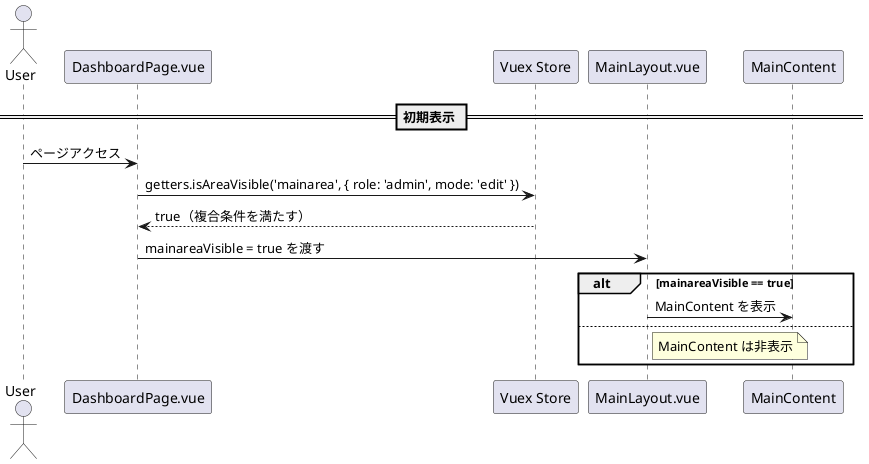

了解しました。
ここでは、**Vuex の getter に引数を渡して表示制御（例：`mainarea` の可視状態）を取得している流れ**を、**PlantUML のシーケンス図**で表現します。

---

## ✅ 前提：構成概要

* `DashboardPage.vue` が `Store.getters.isAreaVisible('mainarea')` を使って `mainarea` の表示有無を判断
* その結果を `MainLayout.vue` に `props`（または `v-model`）として渡す
* `MainLayout.vue` がスロット `mainarea` を表示 or 非表示

---

## ✅ シーケンス図（getter に引数を渡す形式）



---

## 🔎 解説ポイント

| 項目                                                  | 内容                                                            |
| --------------------------------------------------- | ------------------------------------------------------------- |
| `Page -> Store : getters.isAreaVisible('mainarea')` | **引数あり getter の呼び出し**。内部的には `(state) => (areaName) => ...` 形式 |
| `Store --> Page : true`                             | `visibleAreas['mainarea'] === true` の評価結果                     |
| `Page -> Layout`                                    | Vue の props バインディングまたは `v-model` 相当                           |
| `alt` ブロック                                          | `v-if="mainareaVisible"` に基づく描画の分岐                            |

---

## ✅ 実コードのイメージ対応

### store/index.js

```js
getters: {
  isAreaVisible: (state) => (areaName) => {
    return state.visibleAreas[areaName] === true;
  }
}
```

### DashboardPage.vue

```js
computed: {
  mainareaVisible() {
    return this.$store.getters.isAreaVisible('mainarea');
  }
}
```

```vue
<MainLayout
  :mainarea-visible="mainareaVisible"
/>
```

---

## 🎁 オプションでさらに詳細にしたい場合

* `visibleAreas` 全体を表示させる getter 呼び出し
* `MainLayout.vue` からの `v-model:mainareaVisible` による双方向反映
* `mainareaVisible` が変更されたときに `watch` で再評価される流れ

などもシーケンス図に拡張できます。ご希望あれば拡張版も作成可能です！


良い視点です！
Vuex の **getter における「複合条件」**（例：エリア名に加えて、ユーザー権限や現在の画面モードなど）を使って `mainarea` の表示可否を制御したい場合、その処理とシーケンス図の表現は次のようになります。

---

## ✅ 例：複合条件の getter（エリア名＋モード）

### store/index.js

```js
state: {
  visibleAreas: {
    mainarea: true,
    subarea: false
  },
  currentMode: 'edit',
  userRole: 'admin'
},
getters: {
  isAreaVisible: (state) => (areaName, context = {}) => {
    // 複合条件の例：roleがadmin、かつeditモード、かつvisibleAreasがtrue
    const visible = state.visibleAreas[areaName] === true;
    const isAdmin = context.role === 'admin';
    const isEditMode = context.mode === 'edit';
    return visible && isAdmin && isEditMode;
  }
}
```

### 呼び出し側（DashboardPage.vue）

```js
computed: {
  mainareaVisible() {
    return this.$store.getters.isAreaVisible('mainarea', {
      role: this.$store.state.userRole,
      mode: this.$store.state.currentMode
    });
  }
}
```

---

## ✅ シーケンス図：getterに複数引数を渡して評価



---

## 🔎 補足：getter の設計注意点

* Vuex の getter では**複数引数を直接渡すことはできないため**、第1引数で `areaName`、第2引数で `context` のように**オブジェクトでまとめる**のが定石です。
* 型安全にしたいなら `context = {}` にデフォルトを入れる。

---

## ✅ シーケンス図で複合条件を明確にするコツ

* `getter に複数引数` → `Store へラベル付きで渡す`
* 条件付き分岐には `alt` ブロックを活用
* 「何が条件か？」を `note` で補足しておくと読み手にも親切です

---

## 🎁 例：コメント入り強調版

```plantuml
Page -> Store : isAreaVisible('mainarea', { role: 'admin', mode: 'edit' })
note right of Store
  条件:
  - visibleAreas.mainarea === true
  - role === 'admin'
  - mode === 'edit'
end note
Store --> Page : true（すべて満たす）
```

---

必要であれば、これを「他エリアも含む多条件表示制御」や「権限ごとの fallback」まで拡張した例も出せます！
