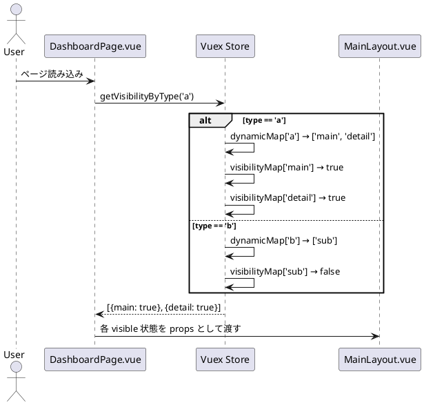

はい、Vuex の **getter 内で「ある条件を満たす引数に応じて別の state 項目を取得する」** という処理も可能です。
これは **「引数に応じた動的参照」や「依存関係をもつ条件分岐」** という形になります。

---

## ✅ 具体的なパターン：

### 🔸「ある引数が○○なら、stateの××を取得する」例

### ◾ 例：引数 `areaName` が `'mainarea'` のときだけ `visibleAreas.mainarea` を返す

```js
getters: {
  conditionalAccess: (state) => (areaName) => {
    if (areaName === 'mainarea') {
      return state.visibleAreas.mainarea;
    } else if (areaName === 'subarea') {
      return state.otherVisibility[subareaKey];
    } else {
      return false;
    }
  }
}
```

---

### 🔸 より動的な例：引数の値に応じて取得先を切り替える

```js
state: {
  visibilityMap: {
    main: true,
    sub: false,
    detail: true
  },
  dynamicMap: {
    a: ['main', 'detail'],
    b: ['sub']
  }
},
getters: {
  getVisibilityByType: (state) => (type) => {
    const targetKeys = state.dynamicMap[type] || [];
    return targetKeys.map(key => ({
      key,
      visible: state.visibilityMap[key] === true
    }));
  }
}
```

### ✅ 使用例：

```js
this.$store.getters.getVisibilityByType('a');
```

→ `[{ key: 'main', visible: true }, { key: 'detail', visible: true }]`

---

## ✅ シーケンス図での表現例

### 🎯「ある条件によって取得対象を切り替える」動きをシーケンス図に落とす：



---

## ✅ ポイント整理

| 項目              | 内容                               |
| --------------- | -------------------------------- |
| `getter(type)`  | 引数によって処理対象が変わる                   |
| `state.xxx[引数]` | 文字列キーで動的にアクセス                    |
| `シーケンス図`        | `alt` や `note` を使って条件分岐のロジックを可視化 |

---

## 🧩 応用シナリオ

* 「ユーザー権限が admin のときだけ mainarea を返す」
* 「選択された画面タイプに応じて使用するコンポーネントやデータを切り替える」
* 「複数の条件（ロール + モード）を見て異なる state を返す」

---

必要であれば、あなたの実際の `state` / `getter` 設計に即したシーケンス図やコード例も作成できます。構造や仕様が決まっていれば教えてください！
