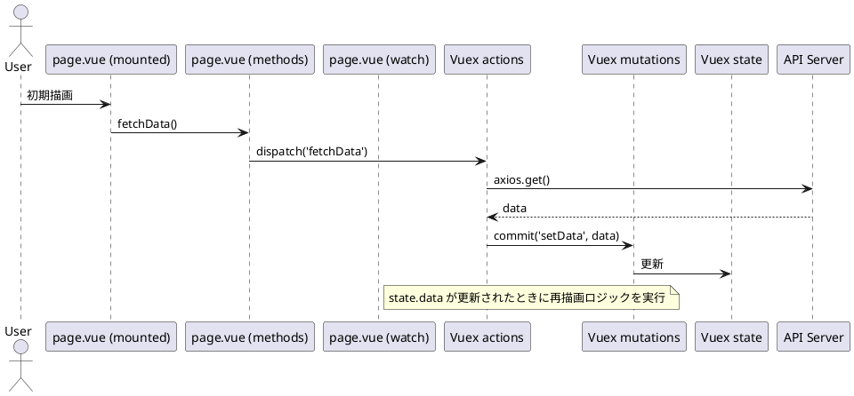

# Vue責務ベース・シーケンス図設計ガイドライン

## 目的

Vueコンポーネントにおける処理構造をシーケンス図で正確に可視化し、実装責務を明確化する。チーム内での設計レビュー、保守、テスト設計、レビュー効率向上を目的とする。

---

## 対象範囲

* Vue 3 + TypeScript + defineComponent構成
* オプションAPI混在構成（setup, data, methods, watch, mounted, computed など）
* Vuex を用いた状態管理

---

## 責務ベースで分ける理由

| 観点        | 説明                                   |
| --------- | ------------------------------------ |
| 単一責任の明確化  | 各ライフサイクルや機能の責務を独立して図示し、影響範囲を明確化する    |
| 保守性の向上    | 仕様変更・リファクタリング時にどの責務に影響があるかを視覚的に判断可能  |
| 補完とレビュー支援 | IDEの補完と一致した粒度で設計を図示することでレビューがスムーズになる |

---

## 推奨 participant 構成（責務ごと）

```plantuml
participant "page.vue (setup)" as Setup
participant "page.vue (data)" as Data
participant "page.vue (methods)" as Methods
participant "page.vue (watch)" as Watch
participant "page.vue (mounted)" as Mounted
participant "Vuex actions" as Actions
participant "Vuex mutations" as Mutations
participant "Vuex state" as State
participant "API Server" as API
```

---

## 書き方のルール

### 1. setup

* 初期値の計算・propsの取得・injectなどの初期化ロジックを図示

### 2. data

* templateと連動するUI制御用のローカル状態を保持

### 3. methods

* UIイベントのトリガー処理（onClick, onChange）
* Vuex dispatch や commit 呼び出しもここを入口とする

### 4. watch

* propsやstateの変化に対する副作用（API再取得、UI再描画など）

### 5. mounted

* DOMに依存した描画後処理（チャート描画、ref操作など）

---

## サンプルシーケンス図（概要）



---

## チーム導入のポイント

* 最初に1ページだけ責務ベースで設計し、レビューで効果を共有する
* 上記 participant 命名規則を共通化（補完しやすくする）
* `page.vue` 単位でテンプレートを整備し、他ページに横展開

---

## 補足：Composition API の場合

setupの中にwatch, computedを内包することもあるが、
責務が異なるため participant として分離して記述することを推奨する。

---

以上
