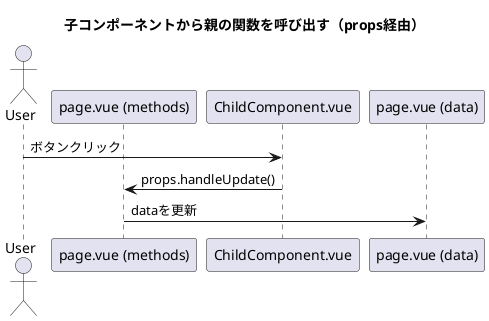
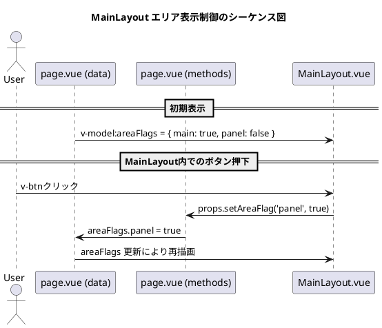

ありがとうございます、方針を正確に把握しました。

あなたのように「**親 → 子へ関数を props 経由で渡し、子からそれを呼び出して親に影響を与える**」場合、シーケンス図では以下のように表現するのが最適です。

---

## ✅ Vue における「props関数呼び出し」のシーケンス図構成



---

## 🧩 このようなコード構成に対応

### 親コンポーネント（page.vue）

```ts
<template>
  <ChildComponent :onUpdate="handleUpdate" />
</template>

<script lang="ts">
export default defineComponent({
  data() {
    return {
      count: 0
    }
  },
  methods: {
    handleUpdate() {
      this.count += 1
    }
  }
})
</script>
```

### 子コンポーネント（ChildComponent.vue）

```ts
<template>
  <v-btn @click="onUpdate">更新</v-btn>
</template>

<script lang="ts">
export default defineComponent({
  props: {
    onUpdate: {
      type: Function,
      required: true
    }
  }
})
</script>
```

---

## ✅ シーケンス図で重要な表現ポイント

| ポイント            | 表現方法例                                                                           |
| --------------- | ------------------------------------------------------------------------------- |
| propsで関数を渡している  | `"page.vue (methods)" → "Child.vue"` で矢印付きラベル： `props: onUpdate = handleUpdate` |
| 子から関数を呼び出して親に影響 | `"Child.vue" → "page.vue (methods)"` としてイベントを明示                                 |
| 親の状態更新          | `"page.vue (methods)" → "page.vue (data)"` で `this.count++` などを描く               |

---

## ✅ まとめ

* emit を使わない構成では、**「props関数の participant」＝ 親の methods** として扱うのが最も自然
* 子 → 親の間接呼び出しでも、**実質的には直接関数を叩いているのでストレートに描く**
* 「どこで状態が更新されているか」を明示することで、再描画や副作用の起点が明確になる

---

この方針で複数パターン（バインド、コールバック、非同期含む）を整理したテンプレートも作成できます。必要ですか？


ありがとうございます、その構成に基づく Vue シーケンス図の設計指針を以下に整理します。

---

## ✅ 状況の整理（MainLayout とのやり取り）

| 親 → MainLayout                  | MainLayout → 親                     |
| ------------------------------- | ---------------------------------- |
| `v-model:areaFlags` でエリア表示状態を渡す | `v-btn` などで親の「表示切替関数」を props 経由で呼ぶ |

---

## 🧩 シーケンス図構成（props関数＋v-model制御）



---

## ✅ 補足とルール

* `v-model` は双方向バインディングなので、「**props → Layout 表示**」と「**イベント → 親の状態更新**」が両方ある
* 親から渡す関数（例：`setAreaFlag(type: string, visible: boolean)`）は **props 経由のコールバック** として扱う
* Layout 側は emit を使わず、単に渡された関数を呼ぶだけの構成（あなたの方針）

---

## 🎯 まとめ

* `v-model` で親の状態を MainLayout に反映 → 表示制御
* MainLayout 内のユーザー操作で `props 関数呼び出し` → 親が state 更新 → v-model 経由で Layout 再描画

このように「**双方向制御だけど emit を使わない構成**」を明示できるのが、責務ベースのシーケンス図の強みです。

---

ご希望であれば、この構成をベースにしたテンプレート `.puml` や説明ドキュメント化も可能です。出力しますか？
