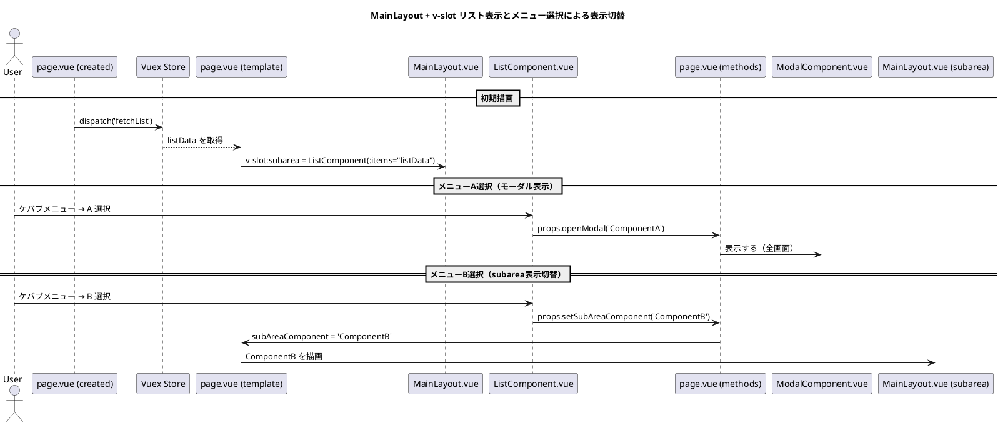
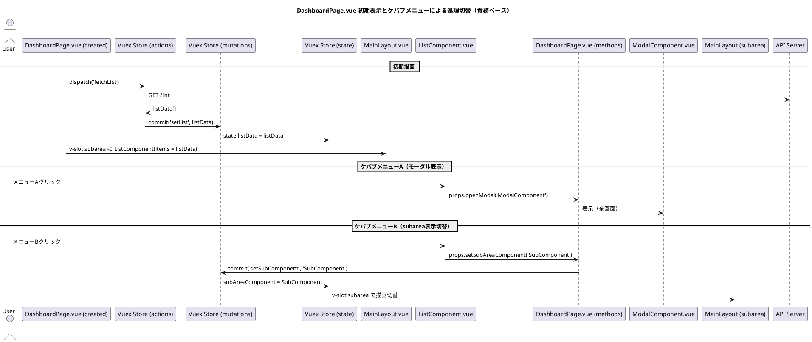

ありがとうございます。
この構成を正しく可視化するには、「**レイアウト構成**」「**データの流れ（store → props）**」「**ユーザー操作によるコンポーネント表示の切替**」の3点を押さえる必要があります。

---

## ✅ 構成と責務の全体像

```plaintext
page.vue
├── Vuex store からリストデータ取得
├── MainLayout に v-slot:subarea で ListComponent を挿入
│   └── ListComponent は props.items 経由でリスト表示
│   └── 各行にケバブメニューあり（v-menu）
│       ├── メニューA: 親の showModal() を呼ぶ → モーダル表示
│       └── メニューB: 親の setSubAreaComponent() を呼ぶ → subarea 差し替え
```

---

## 🧩 責務ベースのシーケンス図（全体構成）



---

## ✅ ポイント整理

| 要素               | 説明                       |
| ---------------- | ------------------------ |
| `v-slot:subarea` | 子コンポーネント（List）を差し込む構造を明示 |
| `props.items`    | 親の store から取得したデータをバインド  |
| `props.関数呼び出し`   | emit を使わず、関数バインドで親に通知    |
| `subarea 差し替え`   | store は介さず、親の状態で表示切替を制御  |

---

ご希望があれば、これをドキュメント（説明付き）として反映します。反映してよいですか？

素晴らしい指摘です。
Vuex（store）をシーケンス図でどう扱うかは、**設計の粒度と責務の明確化のバランス**によって決まります。

---

## ✅ 回答：**責務ごとに分離すべきかどうかは「図の目的」による**

| 設計の目的                    | Storeを分離する？                              | 説明               |
| ------------------------ | ---------------------------------------- | ---------------- |
| 全体の処理の流れをざっくり見せたい        | ❌ 1つの `Vuex Store` にまとめる                 | 見やすく簡潔でよい        |
| 各責務の明確な責任・状態遷移を図示したい     | ✅ `actions` / `mutations` / `state` に分ける | 誰が何を更新するかを可視化できる |
| 複数の store モジュールが関与している場合 | ✅ `userStore`, `listStore` などに分ける        | module単位の責任を示せる  |
| 設計書／レビュー用の精密図            | ✅ 分けるべき                                  | 品質保証や実装との対応がしやすい |

---

## ✅ あなたの構成に適した責務ベースのStore分離案

```plantuml
participant "Vuex Store (list/actions)" as ListActions
participant "Vuex Store (list/mutations)" as ListMutations
participant "Vuex Store (list/state)" as ListState
```

### フロー例：

```plantuml
page.vue (created) -> ListActions : dispatch('fetchList')
ListActions -> API : axios.get('/list')
API --> ListActions : [item1, item2]
ListActions -> ListMutations : commit('setList', data)
ListMutations -> ListState : state.listData = data
```

---

## 🧩 Vuexモジュール責務の視点

| 部分          | 責務例                   |
| ----------- | --------------------- |
| `actions`   | 非同期通信、ロジック分岐          |
| `mutations` | 状態更新（必ず同期）            |
| `state`     | データ保持、描画トリガ           |
| `getters`   | 派生情報の取得、computed-like |

---

## ✅ まとめ

| 図の目的       | storeの粒度                          |
| ---------- | --------------------------------- |
| 概要図        | 1 participant にまとめる               |
| 詳細設計       | 責務ごとに分ける（actions/mutations/state） |
| 実装対応表・レビュー | module単位に分けるのも◎                   |

---

必要であれば、\*\*現在の構成に基づいた責務分離済みのシーケンス図（再構成）\*\*を出力できます。作成しますか？

ありがとうございます。以下に、あなたの構成（`DashboardPage.vue` が `MainLayout.vue` を介してリストとエリアを制御し、Vuex ストアでリストデータを保持）をベースに、**責務ごとに分離した Vuex Store 含むシーケンス図（初期表示 + メニュー操作）** を作成しました。

---

## ✅ 責務ベースのシーケンス図（初期表示とケバブメニュー選択）



---

## ✅ 図のポイント

| 区分                                                 | 内容                    |
| -------------------------------------------------- | --------------------- |
| `Vuex Store` は `actions`, `mutations`, `state` に分離 | 責務を明確化（API処理／状態変更／保持） |
| `v-slot` の流れも記述                                    | 描画責任の流れが可視化される        |
| `propsで関数渡す → 呼び出し → 表示切替` の構造が明示                  | emit を使わない構成にも完全対応    |
| modal / subarea の UI表示切替も明示                        | 全画面とレイアウト内の切替がわかりやすい  |

---

この図を `.puml` ファイル形式やドキュメント化（PDF, Markdown, PPTなど）にも変換可能です。
ご希望の出力形式はありますか？
