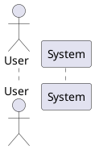
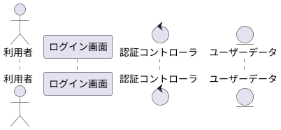
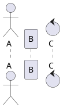

以下に、PlantUML における **登場人物（ライフライン）の定義**について、実例付きで丁寧に整理します。

---

## ✅ 1. 登場人物（ライフライン）の定義

### 基本構文



| 種類            | 用途（表記上の意味）     | 表示例 |
| ------------- | -------------- | --- |
| `actor`       | システムの外部ユーザー・人間 | 👤  |
| `participant` | 汎用的な処理対象・クラス   | □   |
| `boundary`    | 境界クラス（画面/UIなど） | ◇   |
| `control`     | 制御クラス・業務ロジック   | ◆   |
| `entity`      | エンティティ（DBやモデル） | ○   |

---

### エイリアス付き定義

ラベルと変数名（エイリアス）を分けることで、**日本語表示しつつコードは英語変数で管理**できます。



* `"表示名" as 変数名` 形式
* メッセージ送信などでは `User -> AuthCtrl` のようにエイリアス名で操作

---

### 位置関係の調整（明示順）

PlantUML は定義順に左→右に表示されます：



これにより、**意図的に左→右の構造**を作ることが可能です。

---

### 表示カスタマイズ（skinparam 例）

```plantuml
skinparam actorStyle awesome
skinparam participantPadding 20
skinparam backgroundColor #FDF6E3
```

* `actorStyle awesome`：アイコンを人型に変更
* `participantPadding`：ライフライン間の余白
* `backgroundColor`：背景色の変更

---

## 🧪 まとめ：どのように使い分ける？

| 表記            | 役割のイメージ例                           |
| ------------- | ---------------------------------- |
| `actor`       | ユーザー、外部システム、API呼び出し元               |
| `participant` | コントローラ、Vue/Reactコンポーネント、バックエンド関数など |
| `boundary`    | 入力フォーム、UI画面                        |
| `control`     | 業務ロジック、Vuex・Storeなど                |
| `entity`      | DBエンティティ、データモデル、リポジトリ              |

---

次に学ぶなら、`メッセージの種類（->, ->>, -->）`や `activate/deactivate` が自然なステップです。深掘りしますか？
