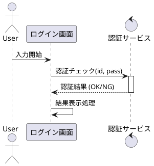

以下に、**PlantUML シーケンス図でのメッセージの種類**を、用途・構文・視覚イメージとともに整理します。

---

## ✅ 2. メッセージの種類（Message Types）

| メッセージ種別  | 記法             | 用途・意味                     |
| -------- | -------------- | ------------------------- |
| 同期メッセージ  | `A -> B`       | 関数やAPIの**同期呼び出し**（ブロッキング） |
| 非同期メッセージ | `A ->> B`      | キューやイベントの**非同期呼び出し**      |
| 応答（戻り値）  | `B --> A`      | **レスポンス、戻り値**の受け取り        |
| 自己呼び出し   | `A -> A`       | **再帰的処理、ループ的処理**          |
| 破線メッセージ  | `-->` / `-->>` | **処理強調なし**や**非主要な流れの表現**  |

---

### 🔷 実例コード（まとめ）



---

### 💡 各メッセージの視覚イメージと補足

#### 🔹 同期 `->`

* 通常の「関数呼び出し」「処理移譲」
* 矢印の先に**棒（ライフライン）が延びる**

#### 🔹 非同期 `->>`

* イベント通知や**即時返却不要な処理**
* 矢印の先に**ライフラインが延びない**

#### 🔹 応答 `-->`

* 処理が終わって**呼び出し元に戻る**
* `return` 的な動き

#### 🔹 自己呼び出し `A -> A`

* メソッドの中で自分の別処理を呼ぶ、再帰、ローカルループなど
* 視覚的に**くるっと回り込む**

#### 🔹 破線 `-->`, `-->>`

* 明示的に「重要ではない戻り値」や「補足処理」を**強調しない**
* ドキュメントの読み手にとっては「さらっと読ませる用」

---

## 📌 補足：テキスト付き矢印

```plantuml
A -> B : 関数名(param1, param2)
B --> A : 戻り値（成功/失敗）
```

---

## 🧭 次に学ぶべき項目

* `activate` / `deactivate` で **処理ブロックの強調**
* `alt`, `loop`, `opt` などの **制御構造（条件・繰り返し）**

必要であれば、それぞれの記法を図付きで解説します。どちらに進みますか？
