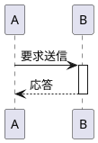
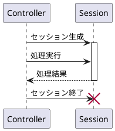

以下は、**PlantUML シーケンス図におけるライフライン制御の文法**についての解説です。処理の流れやオブジェクトのライフサイクルを明示するのに使います。

---

## ✅ 3. ライフラインの制御

### 🟦 1. `activate` / `deactivate`

#### ✔ 意味

* `activate`: ライフライン（オブジェクト）の**アクティブ期間を開始**（＝処理中を表す）
* `deactivate`: **処理の終了**を明示

#### 🔤 記法

```plantuml
activate 対象
deactivate 対象
```

#### 🧪 例



🖼️ `B` のライフライン上に\*\*縦の太線（実行ブロック）\*\*が表示されます。

---

### 🟥 2. `destroy`

#### ✔ 意味

* オブジェクトの\*\*破棄（ライフライン終了）\*\*を明示する

#### 🔤 記法

```plantuml
destroy 対象
```

#### 🧪 例



🗑️ `destroy` を使うと、**×印のついた終了マーク**がライフライン末尾に追加されます。

---

## 📌 補足：自動アクティベーションも可能

オプションとして、**すべての `->` に対して自動的に `activate` を付ける**設定もできます：

```plantuml
autostart
```

もしくは

```plantuml
skinparam sequence {
  ParticipantAutoActivation true
}
```

---

## 🧭 学習の次ステップ

次は、以下のような**処理ブロックの構造化**に進むのがオススメです：

* `alt` / `else` / `end`：条件分岐
* `loop`：繰り返し処理
* `opt`, `par`, `break`, `critical`

必要なら、それぞれの使い方と図を解説します！進めますか？
