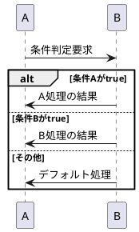
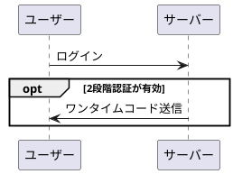
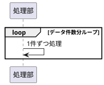
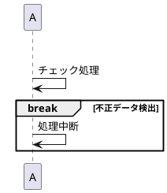
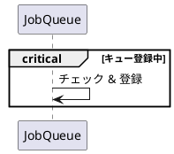

以下に、PlantUML シーケンス図における **制御構造（条件分岐・繰り返しなど）** の文法と実例を整理します。

---

## ✅ 4. 制御構造（条件分岐・繰り返し）

| 制御文        | 用途                 | 複数ブロック対応 | 終了記述  |
| ---------- | ------------------ | -------- | ----- |
| `alt`      | 条件分岐（if / else）    | ✅ Yes    | `end` |
| `opt`      | 単一条件での処理（optional） | ❌ No     | `end` |
| `loop`     | ループ処理（繰り返し）        | ❌ No     | `end` |
| `par`      | 並列処理               | ✅ Yes    | `end` |
| `break`    | 中断（条件により処理打ち切り）    | ❌ No     | `end` |
| `critical` | 排他処理（同時実行禁止）       | ❌ No     | `end` |

---

### 🟨 1. `alt` / `else` / `end`（条件分岐）



---

### 🟦 2. `opt`（単一条件）



---

### 🔁 3. `loop`（繰り返し処理）



📝 `loop (条件)` のように条件名をラベルに付けても OK。

---

### 🟥 4. `par`（並列処理）

```plantuml
@startuml
participant API
participant Logger
participant Notifier

par ログ保存
  API -> Logger : saveLog()
and 通知送信
  API -> Notifier : sendEmail()
end
@enduml
```

📌 `par` → `and` → `end` で並列処理を表現します。

---

### 🛑 5. `break`（中断）



---

### 🧷 6. `critical`（排他処理）



🔒 並行アクセス禁止の処理などに使えます。

---

## 🧭 補足

すべてのブロックには明示的な `end` が必要です。

---

## 🎓 学習の次ステップ（推奨）

* `note`（コメント挿入）
* `autonumber`（メッセージ番号付け）
* `group`, `box`, `title`（構造整理）

どれを深掘りしたいですか？
