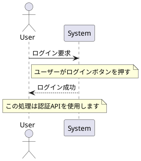
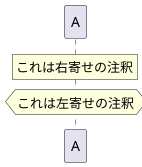

以下は、PlantUML のシーケンス図における **注釈（コメント）の記述方法** を整理した内容です。図の可読性・解説力を高めるために非常に有効です。

---

## ✅ 5. 注釈（コメント）の記述

### 🟨 基本構文

```plantuml
note left of A : コメント内容
note right of B : コメント内容
note over A,B : コメント内容
```

| 記法                | 説明                     |
| ----------------- | ---------------------- |
| `note left of A`  | ライフライン `A` の左側に注釈      |
| `note right of B` | ライフライン `B` の右側に注釈      |
| `note over A,B`   | 複数のライフラインにまたがる注釈（中央寄せ） |

---

### 🧪 実例：基本コメント



---

### 🟥 `rnote` / `hnote` / `note as`（位置調整・変形）

| 記法          | 説明                     |
| ----------- | ---------------------- |
| `rnote`     | **右寄せノート（right note）** |
| `hnote`     | **左寄せノート（left note）**  |
| `note as X` | **ノートの名前定義（再利用可）**     |



---

### 🧱 複数行の note

```plantuml
note right of A
  この処理は以下を行います：
  - 認証チェック
  - トークン生成
  - ログ保存
end note
```

---

## 🎨 補足：スタイル調整

```plantuml
skinparam noteBackgroundColor #FFFDE7
skinparam noteBorderColor Gray
```

---

## 🧭 次のおすすめ項目

* `autonumber`：番号付けによる処理順明示
* `group`, `box`, `title`：図のセクション分け

注釈は「情報の補足」に便利ですが、「構造整理」と組み合わせるとドキュメント力が一段上がります。続けて深掘りしますか？
