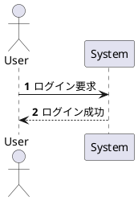

以下は、PlantUML における **自動番号付け（`autonumber`）** の詳細解説です。シーケンス図のメッセージに連番を付けて、**処理の順序を明確に示す**際に役立ちます。

---

## ✅ 6. 自動番号付け（`autonumber`）

### 🟦 基本構文

```plantuml
autonumber
```

メッセージ（`->`, `-->`, `->>` など）の前に **自動で番号が付与**されます。

---

### 🧪 使用例：基本



📌 結果：

```
1. ログイン要求
2. ログイン成功
```

---

### ⚙️ オプション形式と構文一覧

| 記法                                 | 意味                    |
| ---------------------------------- | --------------------- |
| `autonumber`                       | デフォルトは 1 から 1 ずつ増加    |
| `autonumber 1 1`                   | 開始番号：1、小数点以下：1（デフォルト） |
| `autonumber 10 10`                 | 開始番号：10、小数点以下：10      |
| `autonumber 1 1 increment 1`       | 1 から 1 ずつ増加           |
| `autonumber 1.1 1.1 increment 0.1` | 1.1 から 0.1 ずつ増加（小数対応） |

---

### 🛑 自動番号の停止・再開

```plantuml
autonumber 1
...
autonumber stop
...
autonumber resume
```

| 記法                  | 説明         |
| ------------------- | ---------- |
| `autonumber stop`   | 番号付けを一時停止  |
| `autonumber resume` | 停止した位置から再開 |

---

### 📌 補足

* 番号は **注釈や note には付かない**
* `alt` や `loop` 内でも **継続的にカウント**される

---

## 🧭 次に進むと良い項目

* `group` / `box`：処理をまとめて構造化
* `title`：図のタイトル明示

必要であれば、`group` や `box` の使い方もご紹介できます。進めますか？
