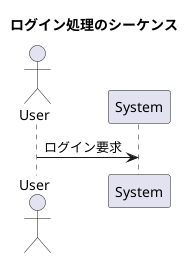
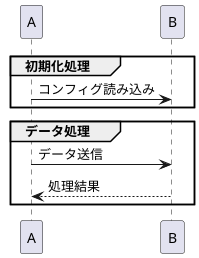
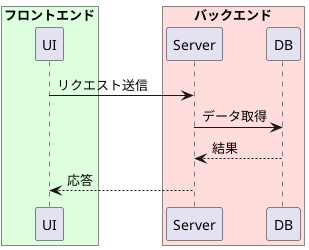
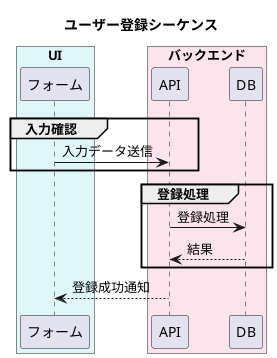

以下に、PlantUML シーケンス図における **グルーピングとタイトルの記法** を整理します。処理の**構造化**や**視覚的な区切り**に非常に有効です。

---

## ✅ 7. グルーピングとタイトル

### 🟦 1. `title`（図全体のタイトル）

* 図の**最上部中央**にタイトルが表示される。
* Markdown の見出し的役割。

---

### 🟨 2. `group`（処理単位のラベル）

* 視覚的に**ブロックとして囲まれ、ラベル表示**
* `alt`, `loop` などと**併用不可**
* 主に「フェーズ分け」「処理グループ分け」に使用

---

### 🟥 3. `box`（領域の明示・枠囲み）

| オプション     | 説明              |
| --------- | --------------- |
| `"ラベル"`   | 表示される領域名        |
| `#カラーコード` | 背景色を指定（HTMLカラー） |

* コンポーネントの**物理的な所属やシステム境界**を示すのに便利
* 色の指定がないと白背景になります

---

## 🧭 `group` vs `box` の使い分け

| 比較対象 | `group`          | `box`                         |
| ---- | ---------------- | ----------------------------- |
| 目的   | 処理の**フェーズ区切り**   | オブジェクトの**論理/物理グループ化**         |
| 表示位置 | 矢印を囲む **処理ブロック** | participant（ライフライン）を**外から囲む** |
| 色指定  | 不可               | `#色コード` で可能                   |

---

## 🧪 応用例：すべて組み合わせ

---

次は「図のレイアウトや外観調整」に進むとよいです。
例えば：`skinparam` の使い方、`hide footbox`、`newpage` など。

続けて学習されますか？
