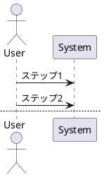
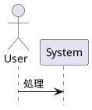

以下に、PlantUML シーケンス図における **高度なレイアウト調整**に関する文法をまとめます。これにより、**見やすく整った図の生成**が可能になります。

---

## ✅ 8. レイアウト調整（高度）

---

### 🟩 1. `newpage`：ページ分割

#### 📌 目的

* **シーケンス図が長くなった場合**にページを分ける

#### 🧪 記法

📄 2ページ目から再びライフラインが表示されます。

---

### 🟦 2. `hide footbox`：ライフライン下の破線を非表示

#### 📌 目的

* 各 participant の **終了点（破線）を非表示**にすることで図をすっきりさせる

#### 🧪 記法

🧼 図の下部がスッキリします（特に短い処理に有効）。

---

### 🟥 3. `skinparam`：スタイル/外観の調整

#### 📌 用途例

| パラメータ                          | 説明                |
| ------------------------------ | ----------------- |
| `skinparam backgroundColor`    | 図全体の背景色           |
| `skinparam participantPadding` | participant 同士の距離 |
| `skinparam sequenceArrowColor` | メッセージ矢印の色         |
| `skinparam defaultFontName`    | フォント名             |
| `skinparam shadowing`          | 影の有無              |

#### 🧪 一括設定例

```plantuml
@startuml
hide footbox
skinparam backgroundColor #FAFAFA
skinparam sequenceArrowColor Navy
skinparam ParticipantBorderColor Gray
skinparam ParticipantBackgroundColor #E3F2FD
skinparam DefaultFontName "Meiryo"
skinparam Shadowing false

actor User
participant System
User -> System : 処理要求
@enduml
```

---

## 🎨 その他便利な設定一覧（抜粋）

| 設定名                            | 説明                                |
| ------------------------------ | --------------------------------- |
| `sequenceParticipantUnderline` | ライフラインの破線（true/false）             |
| `sequenceBoxBackgroundColor`   | `box` 内の背景色                       |
| `sequenceMessageAlign`         | メッセージテキストの位置（left, right, center） |

---

## 🧭 次に学ぶべき応用編（必要であれば）

* `note as` を使った **共通注釈の再利用**
* `return` や `delay` などの**特殊アクション**
* **定義テンプレートの共通化**（macro-like）

ご希望があれば、カスタムテンプレートや、他の UML 図（クラス図など）にも進めます！
