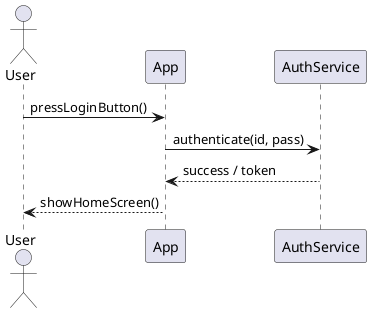

以下は、PlantUML シーケンス図における **メッセージのラベルと戻り値の表現方法** に関する整理です。シーケンス図の**処理内容や結果を明確に記述**するための基本要素です。

---

## ✅ 9. メッセージのラベル・戻り値

---

### 🟦 1. **メッセージにラベル（引数付き関数形式）**

```plantuml
User -> System : login(id, pass)
```

* 矢印の右に「メソッド名（引数）」形式でラベルを記述
* メッセージ名は自由に書ける（自然言語やコード風どちらも可）

#### 🔸 例

```plantuml
UI -> API : submitForm(name, email)
```

---

### 🟨 2. **戻り値の記述（応答）**

```plantuml
System --> User : success / failure
```

* `-->` を使って**戻りの非同期っぽい流れ**を明示
* `return`, `結果`, `OK`, `200 OK`, `true/false` なども自由に書ける

#### 🔸 例

```plantuml
API --> UI : JSON response
```

---

### 🟥 3. **戻り値付きの関数形式にすることも可能**

```plantuml
User -> Server : authenticate(id, pass)
Server --> User : return Token
```

* `return` を使うとコード風になるが、任意表現なので省略もOK

---

### 🧪 フル例：ラベル＋戻り値



---

## 📌 補足ルール

| 項目         | 内容                         |
| ---------- | -------------------------- |
| ラベルの書き方    | `: 処理名(param)` / 自然文どちらもOK |
| 戻り値の書き方    | `-->` or `-->>` を使って右から左へ  |
| ラベルの改行（長文） | `\n` を使って改行できる             |

---

### 🧩 改行付きラベルの例

```plantuml
App -> API : request\nwith payload
API --> App : response\n200 OK
```

---

## 🧭 次のステップ

* **例外処理の表現**（alt と組み合わせて error/success）
* **データ構造やオブジェクト内容を note に補足**

必要であれば、ラベル・戻り値を含めたエラーパターンや API 成功/失敗フローのテンプレートも用意できます。作成しましょうか？
