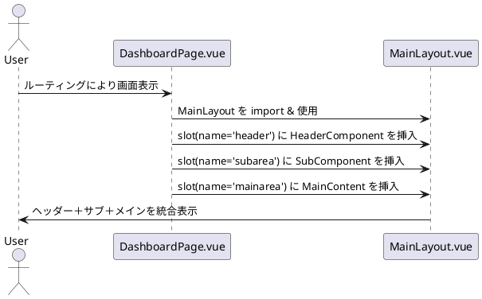

なるほど、ありがとうございます。
あなたの構成は以下のような **逆スロット構造（ページ側からレイアウトに挿入する）** ですね。これは Vuetify + Vue Router を用いた構成でよくある「**ページがレイアウトを制御するスタイル**」です。

---

## ✅ あなたのケースの構造

```vue
<!-- DashboardPage.vue（画面コンポーネント） -->
<template>
  <MainLayout>
    <template v-slot:header>
      <HeaderComponent />
    </template>
    <template v-slot:subarea>
      <SubComponent />
    </template>
    <template v-slot:mainarea>
      <MainContent />
    </template>
  </MainLayout>
</template>

<script>
import MainLayout from '@/layouts/MainLayout.vue'

export default {
  components: { MainLayout }
}
</script>
```

```vue
<!-- MainLayout.vue（レイアウトコンポーネント） -->
<template>
  <v-app>
    <v-container>
      <header-area>
        <slot name="header" />
      </header-area>
      <v-row>
        <v-col cols="3">
          <slot name="subarea" />
        </v-col>
        <v-col cols="9">
          <slot name="mainarea" />
        </v-col>
      </v-row>
    </v-container>
  </v-app>
</template>
```

---

## 🧠 ポイント整理

| 観点         | 説明                                                                     |
| ---------- | ---------------------------------------------------------------------- |
| **親子関係**   | `DashboardPage.vue` が **親**、`MainLayout.vue` が **子**（親がレイアウトにスロットを埋める） |
| **描画構造**   | `DashboardPage` がルーティング対象として描画され、その内部で `MainLayout` を使ってレイアウトを構成       |
| **slot構成** | `DashboardPage.vue` が **MainLayout のスロットに中身を渡す側** になる                  |

---

## 📊 PlantUML シーケンス図的な表現（この構成）



---

## 🧩 補足：この構成のメリット

* **柔軟な画面構成**：ページごとにレイアウトの中身（slot）を切り替えられる
* **共通レイアウトを再利用**：ヘッダー・サイドバーなどの骨格は統一
* **レイアウト制御が各ページ単位で可能**

---

### ご希望あれば：この構成に合わせた図（再描画）も可能です。どうしますか？

@startuml
actor User
participant "DashboardPage.vue" as Page
participant "MainLayout.vue" as Layout
participant "HeaderComponent" as Header
participant "SubComponent" as Sub
participant "MainContent" as Main

User -> Page : ページルーティングで表示開始
Page -> Layout : MainLayout を import
Page -> Header : headerスロット用に呼び出し
Page -> Sub : subareaスロット用に呼び出し
Page -> Main : mainareaスロット用に呼び出し

Page -> Layout : header に HeaderComponent を渡す
Page -> Layout : subarea に SubComponent を渡す
Page -> Layout : mainarea に MainContent を渡す

Layout -> User : header + subarea + mainarea を統合表示
@enduml
